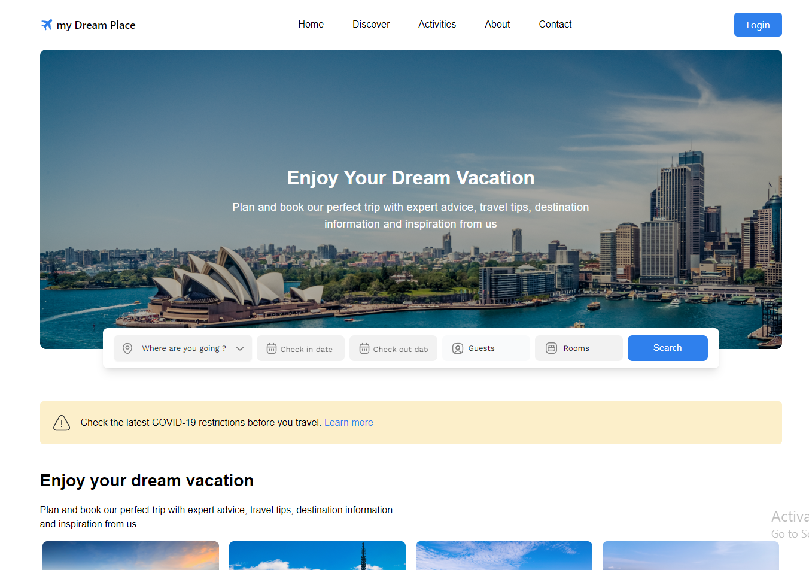
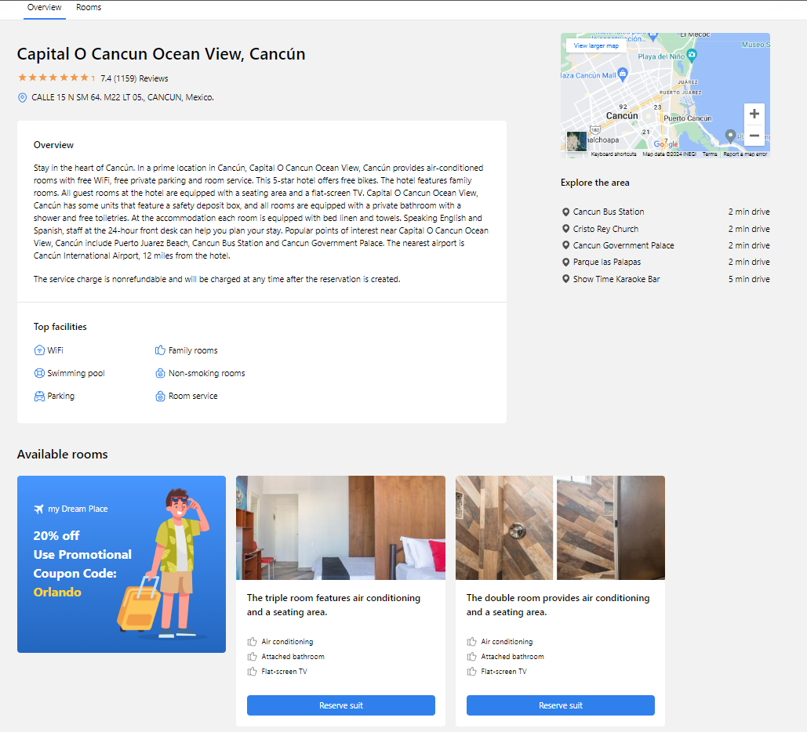
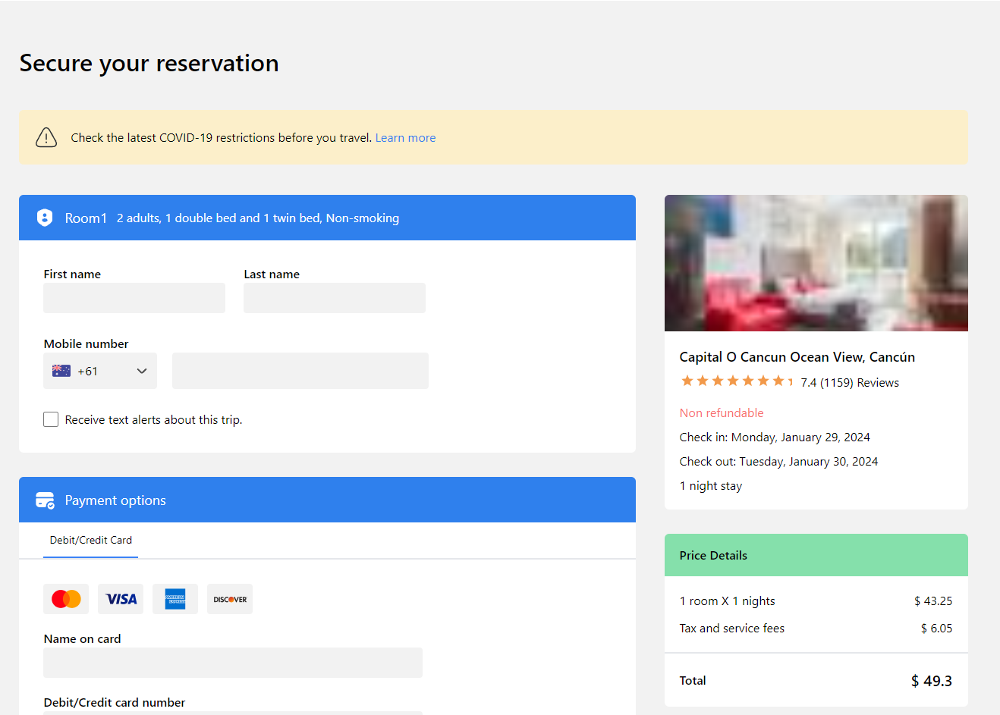
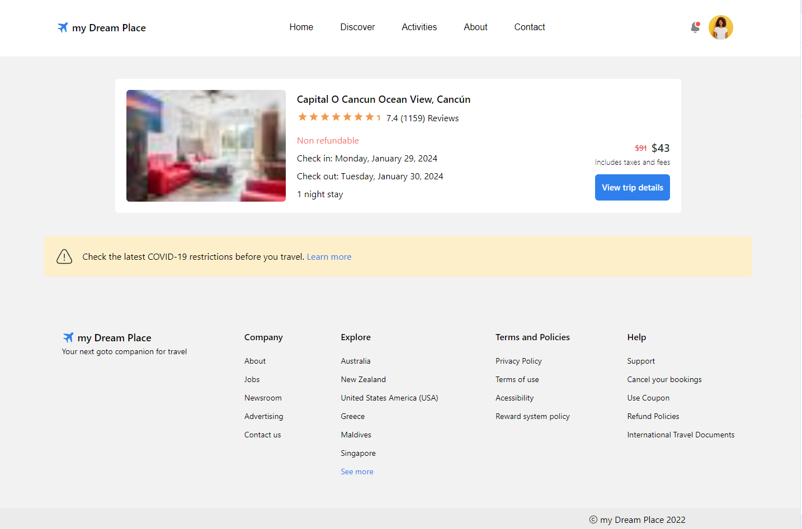

<!-- Improved compatibility of back to top link: See: https://github.com/othneildrew/Best-README-Template/pull/73 -->

<a name="readme-top"></a>

<!--
*** Thanks for checking out the Best-README-Template. If you have a suggestion
*** that would make this better, please fork the repo and create a pull request
*** or simply open an issue with the tag "enhancement".
*** Don't forget to give the project a star!
*** Thanks again! Now go create something AMAZING! :D
-->

<!-- PROJECT SHIELDS -->
<!--
*** I'm using markdown "reference style" links for readability.
*** Reference links are enclosed in brackets [ ] instead of parentheses ( ).
*** See the bottom of this document for the declaration of the reference variables
*** for contributors-url, forks-url, etc. This is an optional, concise syntax you may use.
*** https://www.markdownguide.org/basic-syntax/#reference-style-links
-->

[![Contributors][contributors-shield]][contributors-url]
[![Forks][forks-shield]][forks-url]
[![Stargazers][stars-shield]][stars-url]
[![Issues][issues-shield]][issues-url]
[![LinkedIn][linkedin-shield]][linkedin-url]

<!-- PROJECT LOGO -->
<br />
<div align="center">
  <a href="https://github.com/khalid-debugg/my-dream-place">
    
  </a>

<h3 align="center">My Dream Place</h3>

  <p align="center">
    Where Fantasies Find a Home: My Dream Place - Your Gateway to Luxury Living.
    <br />
    <a href="https://github.com/khalid-debugg/my-dream-place"><strong>Explore the docs »</strong></a>
    <br />
    <br />
    <a href="https://github.com/khalid-debugg/my-dream-place">View Demo</a>
    ·
    <a href="https://github.com/khalid-debugg/my-dream-place/issues">Report Bug</a>
    ·
    <a href="https://github.com/khalid-debugg/my-dream-place/issues">Request Feature</a>
  </p>
</div>

<!-- TABLE OF CONTENTS -->
<details>
  <summary>Table of Contents</summary>
  <ol>
    <li>
      <a href="#about-the-project">About The Project</a>
      <ul>
        <li><a href="#built-with">Built With</a></li>
      </ul>
    </li>
    <li>
      <a href="#getting-started">Getting Started</a>
      <ul>
        <li><a href="#installation">Installation</a></li>
      </ul>
    </li>
    <li><a href="#usage">Usage</a></li>
    <li><a href="#contributing">Contributing</a></li>
    <li><a href="#contact">Contact</a></li>
  </ol>
</details>

<!-- ABOUT THE PROJECT -->

## About The Project



# My Dream Place

Welcome to our Hotel Booking Web App! This application is designed to provide users with a seamless and enjoyable experience when searching and booking hotels. Utilizing the [Booking.com API](https://rapidapi.com/DataCrawler/api/booking-com15/), we bring you real-time access to a vast array of hotels worldwide. The intuitive user interface is based on the meticulously crafted design available on [Figma](https://www.figma.com/file/BQHVuw93nxwUFEnNuyPDdd/Untitled?type=design&node-id=0%3A1&mode=design&t=rGCWh3ItgSBgdGdO-1), ensuring a visually appealing and user-friendly platform.

## Features

- **Search and Discover:** Seamlessly search and discover a wide range of hotels based on your preferences, including location, dates, and accommodation types.

- **Detailed Listings:** Access detailed information about each hotel, including amenities, pricing, and customer reviews, to make informed decisions.

- **Booking Management:** Easily manage your bookings, view reservation details, and make changes as needed.

- **User-Friendly Interface:** Our application boasts an intuitive and responsive design, ensuring a smooth experience across various devices.

- **Real-Time Availability:** Thanks to the Booking.com API integration, we provide real-time availability and pricing information.

<p align="right">(<a href="#readme-top">back to top</a>)</p>

### Built With

- [![Vue][Vue.js]][Vue-url]
- [![Tailwind][Tailwindcss]][Tailwind-url]
- [![Pinia][Pinia]][Pinia-url]

<p align="right">(<a href="#readme-top">back to top</a>)</p>

<!-- GETTING STARTED -->

## Getting Started

### Installation

1. Get your API Key for hotels at [Booking_API](https://rapidapi.com/DataCrawler/api/booking-com15/)
2. Get your API Key for Maps at [Maps_API](https://console.cloud.google.com/)
3. Clone the repo
   ```sh
   git clone https://github.com/khalid-debugg/my-dream-place.git
   ```
4. Install NPM packages
   ```sh
   npm install
   ```
5. Enter your API in `config.js`

   ```js
   const config = {
     apiKey: "GENERATE_YOUR_OWN_KEY",
     mapKey: "GENERATE_YOUR_OWN_KEY",
   };
   ```

<p align="right">(<a href="#readme-top">back to top</a>)</p>

<!-- USAGE EXAMPLES -->

## Usage

### Search results page


In this page you can:

1. Sort hotels according to sort options derived from the API
2. Filter hotels by their names
3. Filter hotels by budget range
4. Filter hotels by review score

<p align="right">(<a href="#readme-top">back to top</a>)</p>

### Hotel Details page



In this page you can browse the hotel details, and its nearby landmarks, and also browse the hotel rooms and its facilities and Reserve it.

<p align="right">(<a href="#readme-top">back to top</a>)</p>

### Checkout page



In this page you can check the price details and confirm room booking

### Trips page



In this page you can check your reserved trips with its details

<p align="right">(<a href="#readme-top">back to top</a>)</p>

<!-- CONTRIBUTING -->

## Contributing

Contributions are what make the open source community such an amazing place to learn, inspire, and create. Any contributions you make are **greatly appreciated**.

If you have a suggestion that would make this better, please fork the repo and create a pull request. You can also simply open an issue with the tag "enhancement".
Don't forget to give the project a star! Thanks again!

1. Fork the Project
2. Create your Feature Branch (`git checkout -b feature/AmazingFeature`)
3. Commit your Changes (`git commit -m 'Add some AmazingFeature'`)
4. Push to the Branch (`git push origin feature/AmazingFeature`)
5. Open a Pull Request

<p align="right">(<a href="#readme-top">back to top</a>)</p>

<!-- CONTACT -->

## Contact

Khalid Sherif - [@shefa2130](https://twitter.com/shefa2130) - khalidsherif.dev@gmail.com

Project Link: [https://github.com/khalid-debugg/my-dream-place](https://github.com/khalid-debugg/my-dream-place)

<p align="right">(<a href="#readme-top">back to top</a>)</p>

<!-- MARKDOWN LINKS & IMAGES -->
<!-- https://www.markdownguide.org/basic-syntax/#reference-style-links -->

[contributors-shield]: https://img.shields.io/github/contributors/khalid-debugg/my-dream-place.svg?style=for-the-badge
[contributors-url]: https://github.com/Khalid-debugg/My-Dream-Place/graphs/contributors
[forks-shield]: https://img.shields.io/github/forks/khalid-debugg/my-dream-place.svg?style=for-the-badge
[forks-url]: https://github.com/khalid-debugg/my-dream-place/network/members
[stars-shield]: https://img.shields.io/github/stars/khalid-debugg/my-dream-place.svg?style=for-the-badge
[stars-url]: https://github.com/khalid-debugg/my-dream-place/stargazers
[issues-shield]: https://img.shields.io/github/issues/khalid-debugg/my-dream-place.svg?style=for-the-badge
[issues-url]: https://github.com/khalid-debugg/my-dream-place/issues
[linkedin-shield]: https://img.shields.io/badge/-LinkedIn-black.svg?style=for-the-badge&logo=linkedin&colorB=555
[linkedin-url]: https://www.linkedin.com/in/khalidsherif1/
[product-screenshot]: https://github.com/Khalid-debugg/My-Dream-Place./public/assets/images/Home/Home-screenshot.png
[Next.js]: https://img.shields.io/badge/next.js-000000?style=for-the-badge&logo=nextdotjs&logoColor=white
[Next-url]: https://nextjs.org/
[React.js]: https://img.shields.io/badge/React-20232A?style=for-the-badge&logo=react&logoColor=61DAFB
[React-url]: https://reactjs.org/
[Vue.js]: https://img.shields.io/badge/Vue.js-35495E?style=for-the-badge&logo=vuedotjs&logoColor=4FC08D
[Vue-url]: https://vuejs.org/
[Tailwindcss]: https://img.shields.io/badge/tailwindcss-0F172A?&logo=tailwindcss
[Tailwind-url]: tailwindcss.com
[Pinia]: https://img.shields.io/badge/Pinia-8A2BE2
[Pinia-url]: https://pinia.vuejs.org/
[Angular.io]: https://img.shields.io/badge/Angular-DD0031?style=for-the-badge&logo=angular&logoColor=white
[Angular-url]: https://angular.io/
[Svelte.dev]: https://img.shields.io/badge/Svelte-4A4A55?style=for-the-badge&logo=svelte&logoColor=FF3E00
[Svelte-url]: https://svelte.dev/
[Laravel.com]: https://img.shields.io/badge/Laravel-FF2D20?style=for-the-badge&logo=laravel&logoColor=white
[Laravel-url]: https://laravel.com
[Bootstrap.com]: https://img.shields.io/badge/Bootstrap-563D7C?style=for-the-badge&logo=bootstrap&logoColor=white
[Bootstrap-url]: https://getbootstrap.com
[JQuery.com]: https://img.shields.io/badge/jQuery-0769AD?style=for-the-badge&logo=jquery&logoColor=white
[JQuery-url]: https://jquery.com
